<!--
  ╔══════════════════════════════════════════════════════════╗
  ║  Hey, technical recruiter inspecting the source — nice.  ║
  ║  If you got this far, you already see I notice details.  ║
  ║  rodclikedev@gmail.com  ·  open to senior remote contract║
  ╚══════════════════════════════════════════════════════════╝
-->

  

  
  &nbsp;
  
  &nbsp;
  
  &nbsp;
  

 

  <code>&nbsp;6+&nbsp;</code> <b>YEARS BUILDING</b>
  &nbsp;·&nbsp;
  <code>&nbsp;50+&nbsp;</code> <b>PRODUCTS SHIPPED</b>
  &nbsp;·&nbsp;
  <code>&nbsp;140+&nbsp;</code> <b>CLIENTS</b>
  &nbsp;·&nbsp;
  <code>&nbsp;4.9★&nbsp;</code> <b>RATING</b>

 

<table align="center" border="0">
<tr><td align="center" width="900">

### I ship products from concept to enterprise.

Full-stack engineer and founder out of Curitiba 🇧🇷, six years deep across <b>React · Next.js · TypeScript · Node · Supabase · React Native · Three.js</b>. Most recently founded and led <b><a href="https://agentiiv.com">Agentiiv</a></b> — an enterprise AI platform with 100+ specialized agents, SOC2-certified, partnered with Canada's <b>Vector Institute</b>. Before that, three founder companies and 140+ clients across direct, agency, and Upwork engagements. <b>Currently between roles and actively looking</b> for a senior frontend / full-stack opportunity.

<b>Open</b> for senior remote contract / full-time — US / EU timezones, USD or EUR. Best at: shipping enterprise products end-to-end, leading product engineering, building animation-heavy UX.

</td></tr>
</table>

 

---

 

## ⚡ Selected Work

<table>
  <tr>
    <td width="50%" valign="top">
      <h3>🤖 &nbsp;Agentiiv <i>founder · lead engineer</i></h3>
      
<b>Enterprise AI platform — 100+ specialized agents</b> Research, competitive intelligence, proposals, design, content. SOC2-certified, end-to-end encrypted, Canadian data residency. Strategic partner of <b>Vector Institute</b>. Serving regulated mid-market industries.

      

        <code>Next.js</code> &nbsp;
        <code>TypeScript</code> &nbsp;
        <code>AI / LLM</code> &nbsp;
        <code>Enterprise</code>
      

      

        
        
      

    </td>
    <td width="50%" valign="top">
      <h3>🌐 &nbsp;Zytro <i>3D · cross-platform</i></h3>
      
<b>Web & mobile app with real-time 3D graphics.</b> Cross-platform product blending Three.js / WebGL on the frontend with React Native on mobile. Performance-critical 3D rendering at 60fps across devices.

      

        <code>React Native</code> &nbsp;
        <code>Three.js</code> &nbsp;
        <code>WebGL</code> &nbsp;
        <code>TypeScript</code>
      

      

        
        
      

    </td>
  </tr>
  <tr>
    <td width="50%" valign="top">
      <h3>🏢 &nbsp;Codestra <i>founder · studio</i></h3>
      
<b>Software studio — Founder & Lead.</b> Custom product engineering for clients. Stack-agnostic execution focused on Next.js + TypeScript + Supabase. Where I take ideas from one-line briefs to deployed products.

      

        <code>Next.js</code> &nbsp;
        <code>TypeScript</code> &nbsp;
        <code>Supabase</code> &nbsp;
        <code>Node</code>
      

      

        
        
      

    </td>
    <td width="50%" valign="top">
      <h3>💰 &nbsp;Fit Finance <i>web + mobile</i></h3>
      
<b>Personal finance app — cross-platform.</b> Real-time sync, budgeting, analytics. Animation-first onboarding and dashboard built in Framer Motion. Same codebase across web and native.

      

        <code>React</code> &nbsp;
        <code>React Native</code> &nbsp;
        <code>Framer Motion</code> &nbsp;
        <code>TypeScript</code>
      

      

        
      

    </td>
  </tr>
</table>

<i>+ Talent Flight · Wxllspace · How to Guides · Lacosta Consórcios · and 50+ more at <a href="https://rodcdev.com">rodcdev.com</a></i>

 

---

 

## 💬 What clients say

<table>
  <tr>
    <td width="50%" valign="top">
      
<i>"One of the best professionals you can have on a team. Highly proactive, takes ownership of frontend projects, uses best-in-market frameworks and practices."</i>

      
<b>— Pedro M.</b> · Software Engineer · ⭐⭐⭐⭐⭐

    </td>
    <td width="50%" valign="top">
      
<i>"Extremely competent and committed. His work is always marked by quality, attention to detail, and sharp technical skill."</i>

      
<b>— Flavio Gimenez</b> · Software Engineer · ⭐⭐⭐⭐⭐

    </td>
  </tr>
  <tr>
    <td width="50%" valign="top">
      
<i>"Excellent experience. Meticulous with details, delivered on time, impeccable communication."</i>

      
<b>— Rafael C.</b> · CEO · ⭐⭐⭐⭐⭐

    </td>
    <td width="50%" valign="top">
      
<i>"Consistently impressive with frontend skills and a problem-solving mindset. Writes clean, efficient code."</i>

      
<b>— Nur U.</b> · Software Engineer · ⭐⭐⭐⭐⭐

    </td>
  </tr>
</table>

 

---

 

## 🎯 What I bring

<table>
  <tr>
    <td width="33%" valign="top" align="center">
      <h3>🔨 &nbsp;Build end-to-end</h3>
      Frontend, backend, infrastructure, and the boring glue between them. From Figma file or one-line brief to deployed product.
    </td>
    <td width="33%" valign="top" align="center">
      <h3>🚀 &nbsp;Lead & ship</h3>
      Six years leading product engineering across three founder companies and 140+ clients. I make decisions, unblock teams, ship.
    </td>
    <td width="33%" valign="top" align="center">
      <h3>🎬 &nbsp;Obsess over UX</h3>
      Animation, motion, microinteractions. The interface is part of the product, not a wrapper around the API.
    </td>
  </tr>
</table>

 

---

 

## 🛠️ Stack

  

  
    <b>Daily</b> &nbsp; Next.js · React · TypeScript · Tailwind · Supabase &nbsp;&nbsp;|&nbsp;&nbsp; <b>Cross-platform</b> &nbsp; React Native · Flutter · Three.js / WebGL &nbsp;&nbsp;|&nbsp;&nbsp; <b>Backend</b> &nbsp; Node · Express · Postgres · MongoDB &nbsp;&nbsp;|&nbsp;&nbsp; <b>Tooling</b> &nbsp; Framer Motion · GSAP · Zustand · Redux · Figma · Vercel
  

 

---

 

## 📈 Activity

  <picture>
    <source media="(prefers-color-scheme: dark)" srcset="https://raw.githubusercontent.com/ThiagoC0STA/ThiagoC0STA/output/snake-dark.svg">
    <source media="(prefers-color-scheme: light)" srcset="https://raw.githubusercontent.com/ThiagoC0STA/ThiagoC0STA/output/snake.svg">
    
  </picture>

  
  

 

---

 

## 🎧 Currently fueling the flow

  

 

---

 

<h3 align="center">📩 &nbsp;Hiring? Let's talk.</h3>

  Drop a line at <a href="mailto:rodclikedev@gmail.com"><b>rodclikedev@gmail.com</b></a> or <a href="https://www.linkedin.com/in/rodcdev">LinkedIn</a>. Reply within 24h.

 

  <i>Always shipping.&nbsp;&nbsp;Always learning.&nbsp;&nbsp;Always evolving.</i>

